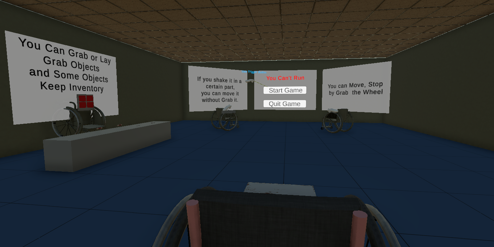
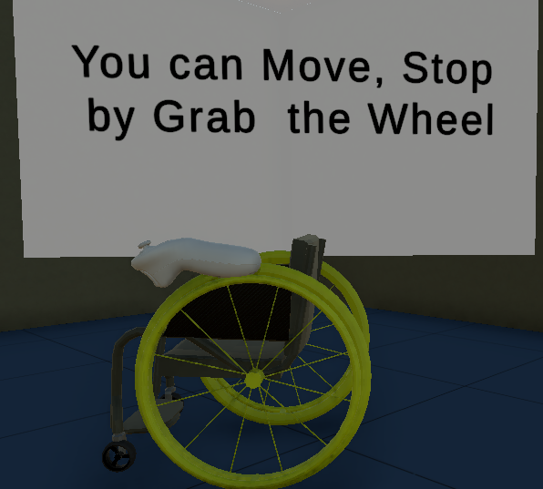
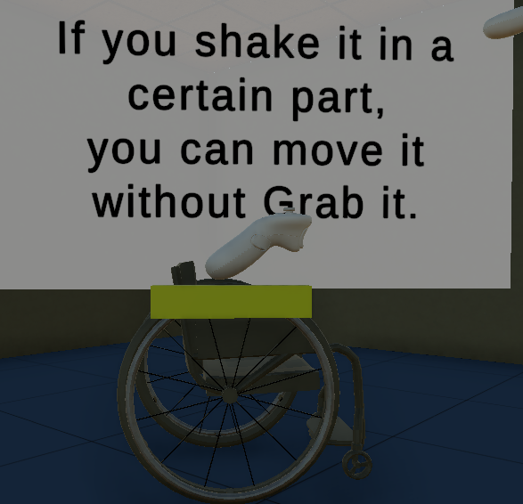
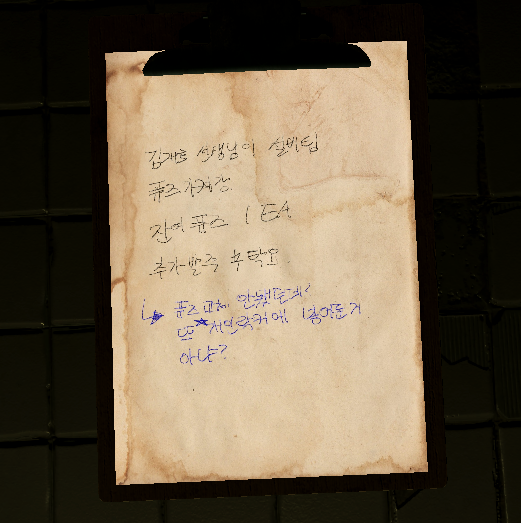
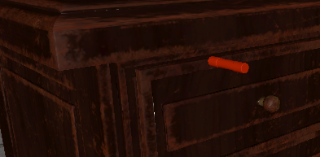
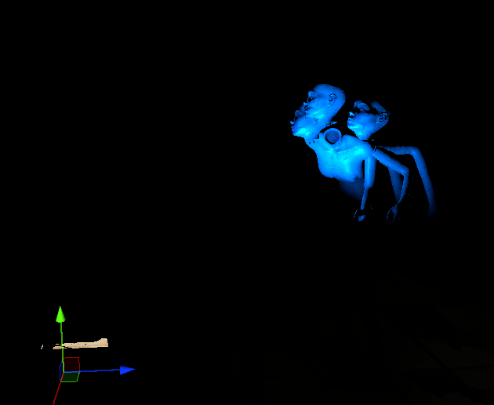

# Dependency and Settings

Unity Version: 2021.3.24f1

XR Interaction Toolkit 2.5.0

Meta Quest 2

# Basic Game Mechanic

## Goal

Your goal is to escape from a strange hospital.

## WheelChair

You can't run or move, you just have to move to a wheelchair

There is an explanation for this in the start scene.

You can grab the wheel with a controller and move it from time to time.

You can also use Move Assist to move the wheel by hovering over a portion of the wheel with the controller.

## Basic Puzzle

There is something to keep in mind when solving puzzles.

Use the hints in the clipboard to help you locate the objects you need.

and some objects visible even when they are obscured by other objects.

## Jump Scare and Fear factor

The screenshot above is a specific jumpsquare.

There are several fear-inducing things like this.

You can see more by playing the game
